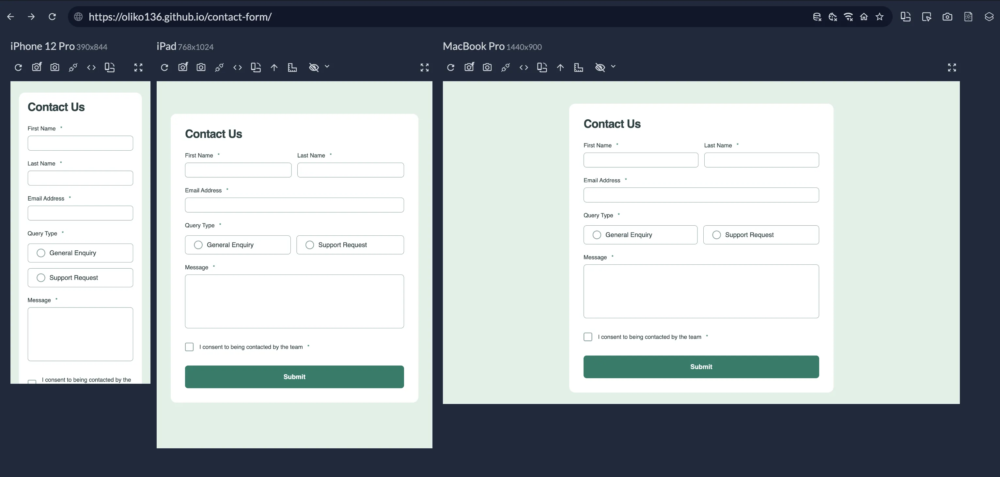
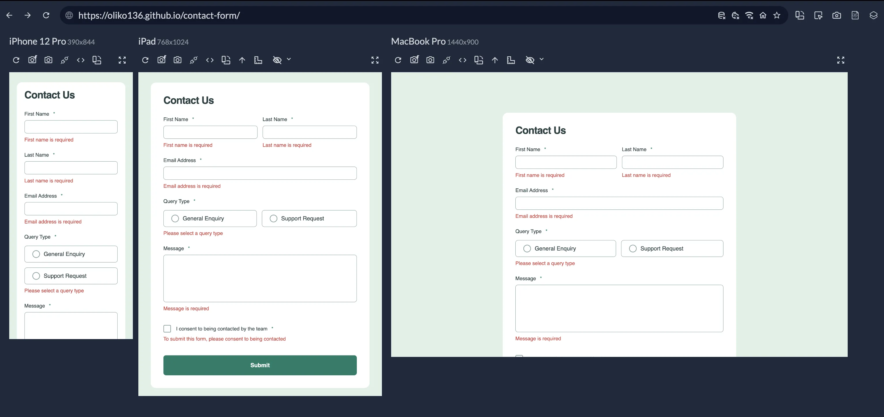
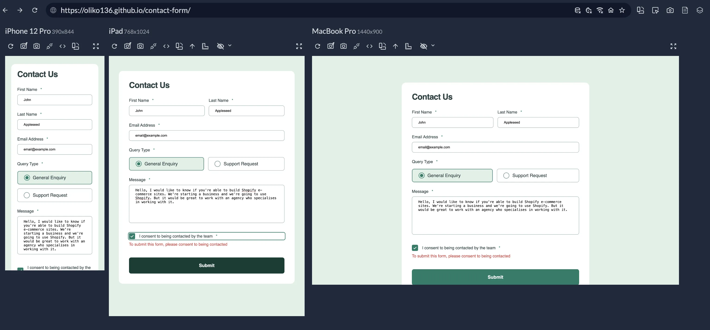
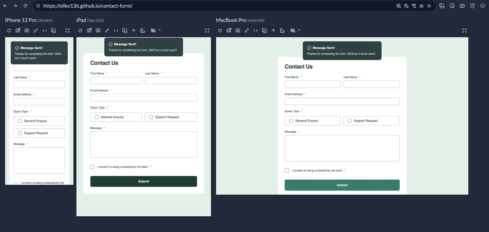

# Frontend Mentor - Contact form solution

This is a solution to the [Contact form challenge on Frontend Mentor](https://www.frontendmentor.io/challenges/contact-form--G-hYlqKJj). Frontend Mentor challenges help you improve your coding skills by building realistic projects.

## Table of contents

- [Overview](#overview)
  - [The challenge](#the-challenge)
  - [Screenshot](#screenshot)
  - [Links](#links)
- [My process](#my-process)
  - [Built with](#built-with)
  - [What I learned](#what-i-learned)
  - [Useful resources](#useful-resources)
- [Author](#author)

## Overview

### The challenge

Users should be able to:

- Complete the form and see a success toast message upon successful submission
- Receive form validation messages if:
  - A required field has been missed
  - The email address is not formatted correctly
- Complete the form only using their keyboard
- Have inputs, error messages, and the success message announced on their screen reader
- View the optimal layout for the interface depending on their device's screen size
- See hover and focus states for all interactive elements on the page

### Screenshot

### Links

- Solution URL: [View solution here](https://github.com/Oliko136/contact-form)
- Live Site URL: [View live page here](https://oliko136.github.io/contact-form/)

## My process

### Built with

- Semantic HTML5 markup
- CSS custom properties
- Flexbox
- Mobile-first workflow
- JavaScript

### What I learned

Use this section to recap over some of your major learnings while working through this project. Writing these out and providing code samples of areas you want to highlight is a great way to reinforce your own knowledge.

### Useful resources

- [Inclusive Inputs. How to make inputs more accessible.](https://www.ovl.design/text/inclusive-inputs/) - An incredibly useful article containing advice on how to properly mark required fields, add descriptions and error messages to corresponding inputs.
- [Indicating form controls as required using asterisks (\*)](https://www.accessibility-developer-guide.com/examples/forms/required/#first-approach-using-aria) - Another super helpful article on how to properly mark required fields to make them accessible.
- [Usable and Accessible Form Validation and Error Recovery](https://webaim.org/techniques/formvalidation/) - A WebAIM article full of practical instructions on how to build accessible forms and validate them.
- [Accessibility and Forms](https://web.dev/learn/accessibility/forms) - A great concise article on all the essentials of form accessibility - semantics, labels, fieldsets, autocompletion, descriptions and errors.

## Author

- LinkedIn - [@olha-sliusarenko](https://www.linkedin.com/in/olha-sliusarenko/)
- X - [@committedto_git](https://x.com/committedto_git)
- Instagram - [@committedto_git](https://www.instagram.com/committedto_git/)
- Frontend Mentor - [@Oliko136](https://www.frontendmentor.io/profile/Oliko136)
